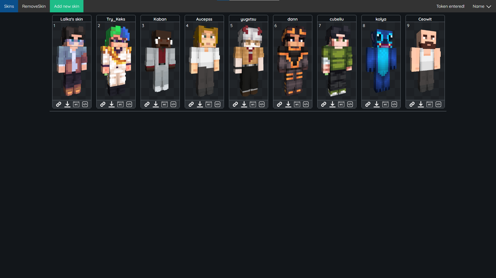

<h1 align="center">This project is for storing your minecraft skins and quick loading to change the skin on the server.</h1>

You can upload a skin file or a minecraft nickname to publish the skin on the site.
After that, you can quickly copy the skin URL, download the image, copy the command for minecraft servers and very quickly install the skin on the FrogDream server.
</img>

<h2>FrogDream API</h2>
If you are a FrogDream player you can instantly change your skin on the server.
To do this, you will need to insert your FrogDream token in the profile of this project.

<h2>Launch instructions</h2>
To run the project, you need to use a local server.
Analyze the code and create suitable MySql databases.

